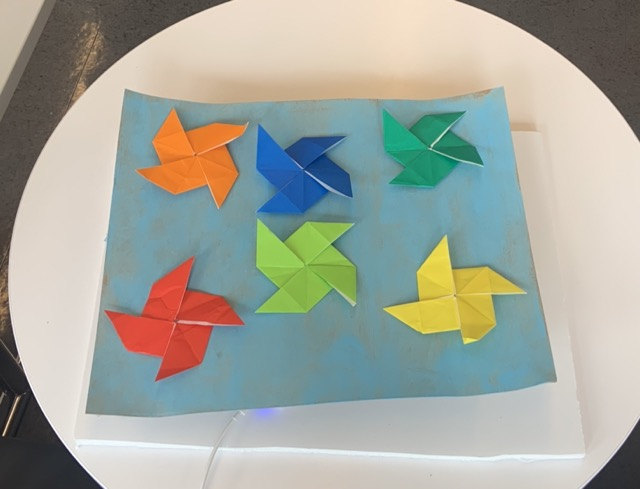
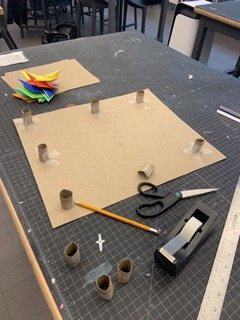

# spinny-pinwheels
colorful pinwheels spin together! calming, dizzying, happy-making its up to you to decide 

## materials 
- ESP32 TTGO T-Display
- USB compatible with computer
- 28BYJ-48 Step Motor
- HXT900 Micro-Servo
- 3.7V 500mAh Battery
- breadboard (optional) 

## hardware and software 
Used the Arduino IDE and included the libraries: ESP32Servo.h, WiFi.h, HTTPClient.h. 
Used pin15 for servo, and pins 33, 27, 26, 25 for stepper. 
Note that the esp32 will be connected to WiFi be sure to include your own WiFi information. 
After the pins are connected and the code is uploaded plug in your battery. 
A web server/API was set up so that our esps could connect to it and run simultanously or once a start button was clicked.  
For more information on how the server was set up and example code for setting the sculpture up to run from the web api visit this github: 
https://github.com/mbennett12/kinetic-sculpture-webapi.git

additionally, youll notice that the code provided runs only 1 stepper and 1 servo. my group wrote very similar code for their own esps and we combined them into the same enclosure. in total our sculpture used 3 esps, each with their own 2 motors.   

## enclosure 
The enclose we created was made out of thin cardboard that was painted with acrylic paint. We used cardboard to create legs for the base of our piece, so that we would have enough room to house the hardware below the base. Additionally, we used a styrofoam board so that our piece could be more easily moved around. The pinweels were made using oragami paper. Everything was secured with tape. 

## demo 

https://youtu.be/x-ua8B4ETJI
